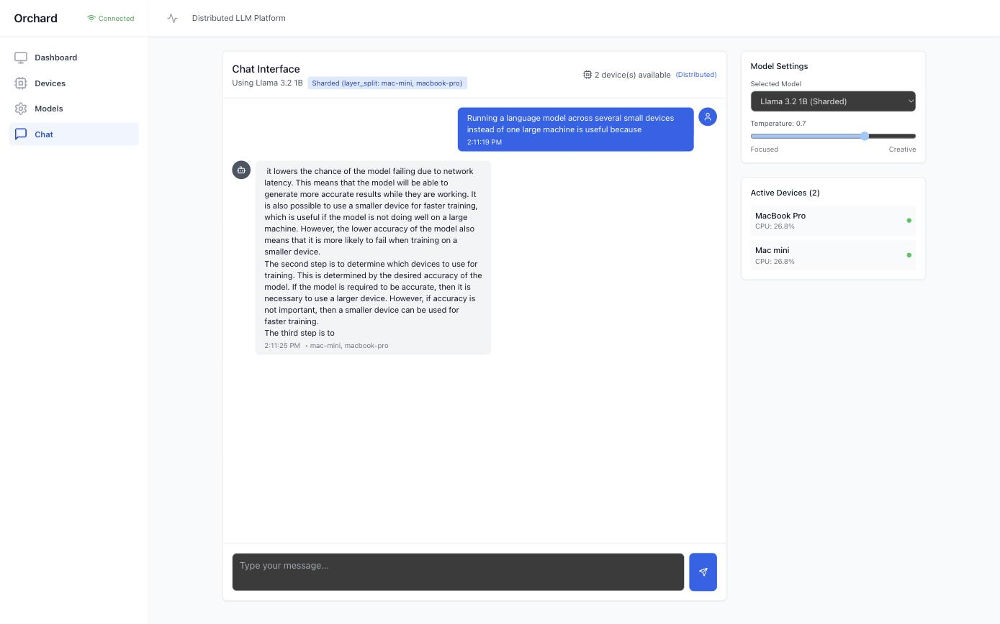
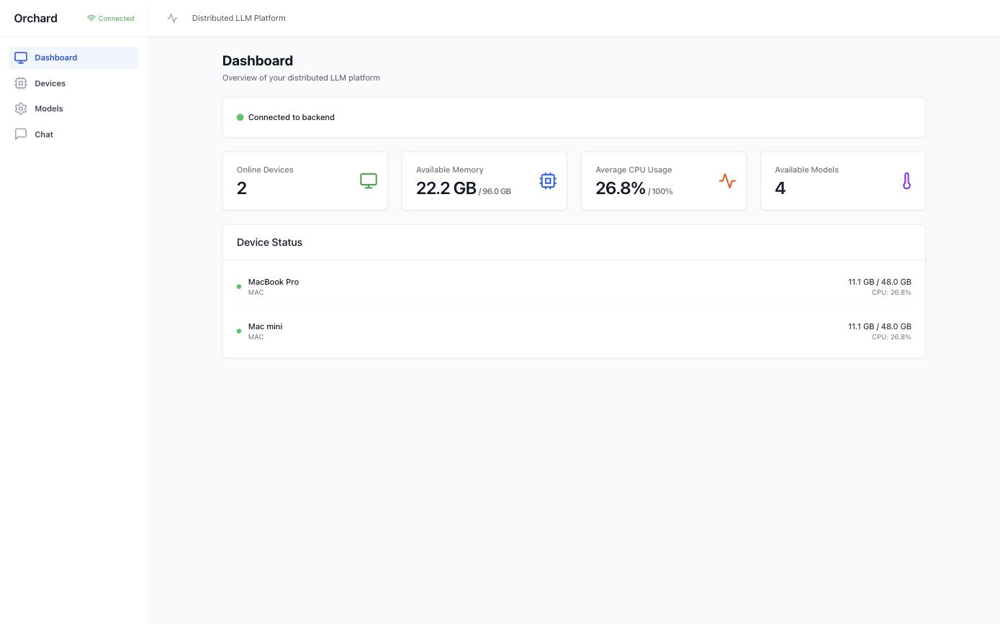
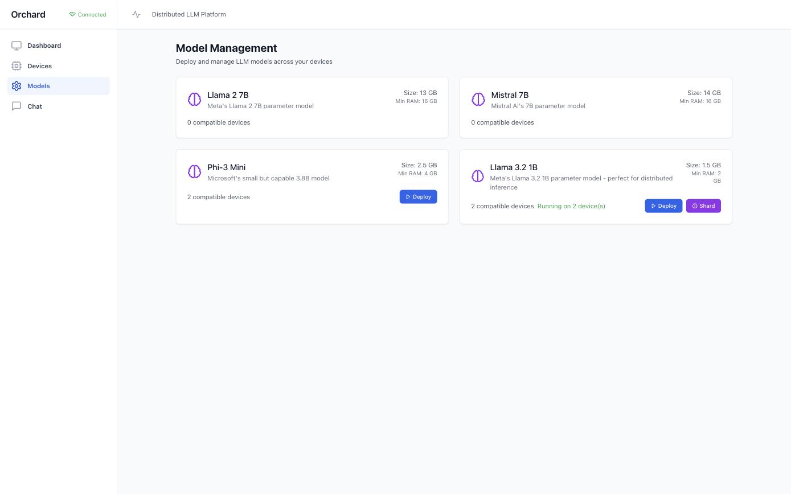
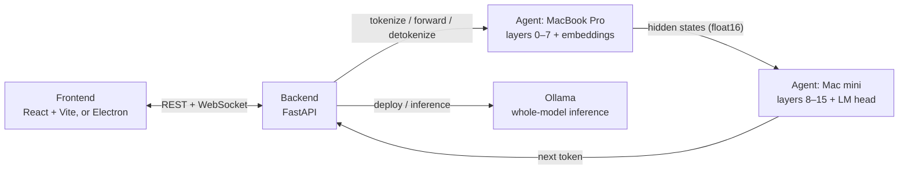

# Orchard

**Run large language models across the Apple devices you already own.**

Orchard turns a Mac, a Mac mini and whatever else is on your desk into one inference cluster. A model's transformer layers are split across devices, hidden states stream between them, and you chat with the result from a web UI or a native macOS app.

<p align="center">
  
</p>

<p align="center">
  
  
  
  
  
</p>

## What it does

- **Layer-split inference.** Llama 3.2 1B is divided into contiguous layer ranges, one per device. The first device holds the embeddings, the last holds the head, and each keeps a KV cache per conversation so every step after the prompt only processes one new token. Output is verified identical to running the whole model on one machine.
- **Single-device inference through Ollama.** Any device running Ollama can serve a whole model on its own. Deploy from the UI and chat.
- **A control plane for your devices.** Agents register with the backend, send heartbeats with CPU and memory, and are marked offline and cleaned up when they disappear. Everything updates live over a WebSocket.
- **A desktop app.** The Electron build bundles the backend with PyInstaller, starts it on a free port, and opens the UI. Quit the app and the backend dies with it.

<p align="center">
  
  
</p>

## How it works



For a sharded chat the backend drives the token loop: it asks the first device to tokenize the prompt, pushes the prompt through every shard in order, gets the next token back from the last shard, and repeats with just that token until the model emits end-of-sequence or hits the token limit. Sessions are released on every device when generation finishes.

The full protocol, including what each `/llama/*` route accepts, is in [LLAMA_SHARDING_README.md](./LLAMA_SHARDING_README.md).

## Quick start

You need Python 3.10+, Node 18+, and [Ollama](https://ollama.com) on any device that will serve whole models.

**1. Backend**

```bash
cd packages/backend
python3 -m venv .venv && .venv/bin/pip install -r requirements.txt
ORCHARD_TOKEN=change-me .venv/bin/python main.py          # http://localhost:8000
```

**2. An agent on each device**

```bash
cd packages/device-agent
python3 -m venv .venv && .venv/bin/pip install -r requirements.txt
ollama pull llama3.2:1b
ORCHARD_TOKEN=change-me .venv/bin/python agent.py --backend-url http://<backend-ip>:8000 --name "MacBook Pro"
```

To take part in sharding, an agent also needs `torch` and `transformers` installed and `ORCHARD_USE_TORCH=1` set. Several agents can run on one machine on different ports for testing.

**3. Frontend**

```bash
cd packages/frontend
npm install && npm run dev                                 # http://localhost:3000
```

Or run the desktop app instead, which starts its own backend:

```bash
npm run electron:dev
```

Open the UI, go to **Models**, and either **Deploy** Llama 3.2 1B to one device or **Shard** it across two or more. Then chat.

## Configuration

Everything is an environment variable with a sensible default.

| Variable | Used by | Purpose |
|----------|---------|---------|
| `ORCHARD_TOKEN` | backend, agent | Shared secret. Agents must send it to register and heartbeat, and the backend sends it when calling agents. Unset disables auth, for local development only. |
| `ORCHARD_AGENT_NAME` | agent | Display name for the device. Also `--name`. Defaults to the hostname. |
| `ORCHARD_AGENT_IP` | agent | Advertise this IP instead of auto-detecting one. Also `--ip`. |
| `ORCHARD_OLLAMA_MODEL` | agent | Ollama tag used when a model id has no mapping (default `llama3.2:1b`). |
| `ORCHARD_OLLAMA_TAG_<MODEL_ID>` | agent | Override the Ollama tag for a catalog model, e.g. `ORCHARD_OLLAMA_TAG_MISTRAL_7B=mistral:7b-instruct`. |
| `OLLAMA_HOST` | agent | Ollama API base URL (default `http://localhost:11434`). |
| `ORCHARD_USE_TORCH` | agent | Set to `1` to enable layer-split sharding. Needs torch and transformers. |
| `ORCHARD_TORCH_DEVICE` | agent | Force `cpu`, `mps` or `cuda` for shards. Default picks cuda, then mps, then cpu. |
| `ORCHARD_HF_MODEL` | backend, agent | Hugging Face checkpoint used for sharding (default `meta-llama/Llama-3.2-1B`, a gated model). |
| `ORCHARD_KV_MAX_SESSIONS`, `ORCHARD_KV_SESSION_TTL` | agent | Bounds on per-session KV caches (default 8 sessions, 300 s). |
| `VITE_BACKEND_URL` | frontend | Backend origin for the browser build and dev proxy (default `http://localhost:8000`). The Electron app sets this itself. |
| `ORCHARD_PYTHON` | Electron dev | Interpreter used to spawn the backend in `electron:dev`. Defaults to the backend `.venv`, then `python3`. |

## Project layout

```
packages/
├── backend/            FastAPI control plane: device registry, model catalog, chat, sharding orchestration
│   ├── main.py
│   ├── llama_sharding.py     layer assignment and the sharded generation loop
│   └── build.py              PyInstaller bundle for the desktop app
├── device-agent/       Runs on each device: Ollama inference, torch layer shards, heartbeats
│   ├── agent.py
│   ├── ollama_inference.py
│   └── llama_sharded_inference.py
├── frontend/           React UI (Vite) and the Electron shell
│   ├── src/
│   └── electron/
└── shared/             Pydantic types shared by backend and agents
```

## API

Backend, all under `/api` except health and the socket:

| Route | Purpose |
|-------|---------|
| `GET /health` | Liveness, identifies itself as `orchard-backend` |
| `GET /api/devices`, `DELETE /api/devices/{id}` | List and remove devices |
| `POST /api/devices/register`, `POST /api/devices/{id}/heartbeat` | Used by agents. Require the token. |
| `GET /api/models`, `POST /api/models/deploy` | Catalog and single-device deployment |
| `POST /api/models/deploy-llama-sharded`, `.../deploy-llama-sharded-auto` | Shard across chosen or all online devices |
| `GET /api/models/sharded-configs` | Active sharding layouts |
| `POST /api/chat`, `POST /api/chat/llama-sharded`, `GET /api/chat/history` | Chat |
| `WS /ws` | `new_message`, `device_update`, `device_removed` events |

Agent routes are `/health`, `/metrics`, `/deploy`, `/inference`, and the `/llama/*` sharding routes described in the sharding guide.

## Development

```bash
# frontend
cd packages/frontend
npm run typecheck && npm run lint && npm run build

# desktop app: bundles the backend, typechecks, builds, and packages for this Mac's architecture
npm run electron:build                 # output in packages/frontend/release/

# whole stack for local testing
./scripts/start-dev.sh && ./scripts/stop-dev.sh
```

The Electron guide covers packaging details and the code-signing constraints that shaped the build: [ELECTRON_GUIDE.md](./ELECTRON_GUIDE.md).

## Troubleshooting

- **Port 8000 is taken.** The backend accepts `--port`. The desktop app probes for a free port itself and verifies the server it finds is actually Orchard before opening the window. For the browser UI, set `VITE_BACKEND_URL` to match.
- **Deploy says a model is not available in Ollama.** The agent checks the tag exists before reporting ready. Run the `ollama pull` command shown in the error on that device.
- **Shard deploy returns 400 about torch.** That agent was started without `ORCHARD_USE_TORCH=1`, or torch and transformers are not installed in its environment.
- **A device shows offline but the agent is running.** Check the token matches on both sides. Heartbeats without a valid token are rejected. Agents re-register automatically when the backend comes back.
- **Sharded replies are slow or wander.** The default checkpoint is a small base model, not an instruct model. It completes text rather than answering questions. Point `ORCHARD_HF_MODEL` at an instruct variant you have access to.

## Status

Verified end to end on macOS: single-device chat through Ollama, layer-split inference across two agents on MPS and on CPU, the web UI, and the packaged desktop app. Only the `layer_split` strategy is implemented. Tensor and pipeline parallelism are rejected rather than simulated.

Next up: selective weight loading so a device never holds the whole checkpoint, concurrent sessions per shard, an instruct model as the default, and agents for iPhone and iPad.

## License

MIT.
